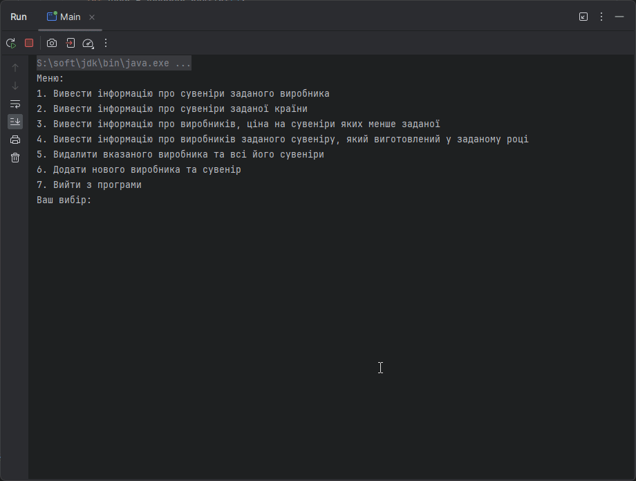

<h1 align="center">ЛАБОРАТОРНА РОБОТА №4</h1>
<h3 align="center">Тема: Робота з джерелами даних у мові Java</h3>
<h3 align="center">Виконав:	Желобецький Арсеній Павлович; група 6.1221</h3>
<h3 align="center">Варіант №5</h3>

## Завдання:

У кожному із завдань необхідно виконати такі дії:
* Організацію з'єднання з базою даних винести окремий клас, метод якого повертає з'єднання.
* Створити БД. Привести таблиці до однієї з нормованих форм.
* Створити клас для виконання запитів на отримання інформації з БД з використанням запитів.
* Створити клас на додавання інформації.
* Створити меню (консольна програма) для виклику відповідної дії.
* Результати виконання запиту видати на консоль.

<h3 align="center">Варіант:</h3>

Сувеніри. У БД зберігається інформація про сувеніри та їх виробників.

  Для сувенірів необхідно зберігати:

* Назва;
* Реквізити виробника;
* дату випуску;
* Ціну.

Для виробників необхідно зберігати:

* Назва;
* Країну.

  Треба:

* Вивести інформацію про сувеніри заданого виробника.
* Вивести інформацію про сувеніри, зроблені в заданій країні.
* Вивести інформацію про виробників, чиї ціни на сувеніри менші за задану.
* Вивести інформацію про виробників заданого сувеніру, виробленого у заданому році.
* Видалити заданого виробника та його сувеніри.

<h3 align="center">Результат:</h3>

  

